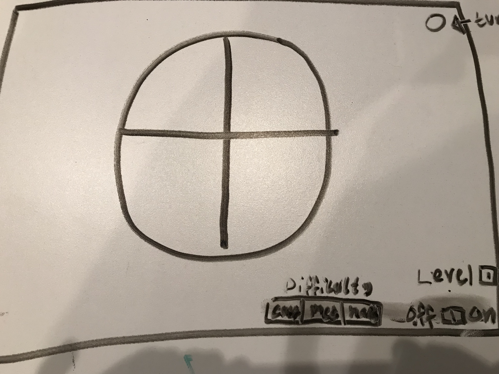

# Simon
[go to my web app!](https://dreamy-khorana-47dae0.netlify.com)

[Visit my trello board](https://trello.com/invite/b/tGNq26fD/320c145321f487fc41fa9c8f4a0be01a/project1-simon)

Simon Says think Fast "repeat the sequence back and see how high you can get"

# Instructions
1. Toggle the on and off switch to on
2. Wait for Simon to play a color
3. When the light in the right hand corner turns green press the color played
4. Wait for Simon to play the same color +1 to the sequence
5. When its your turn repeat the sequence back
6. Continue in this manner and see how high of a level you can get to
7. When done, toggle the on and off switch to off 
8. To play again repeat from 1

# WireFrame

